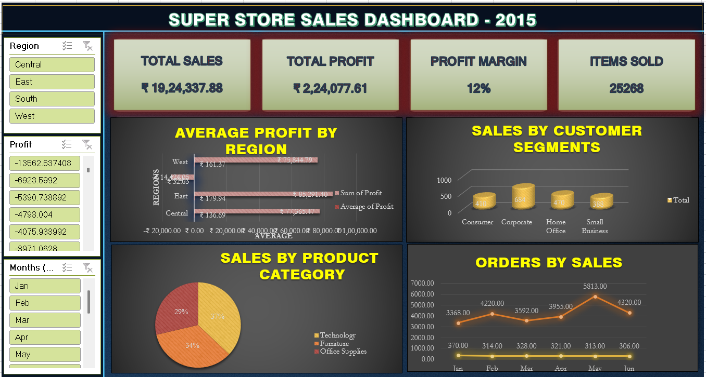

# Superstore Sales Analysis Dashboard – 2015

## 📊 Project Overview

This project presents an interactive **Superstore Sales Analysis Dashboard** created using Microsoft Excel. The dashboard analyzes sales, profit, customer segments, product categories, regional performance, and monthly trends.

The project demonstrates the complete data analysis workflow from raw data cleaning and transformation to analysis and dashboard creation.

## 🛠️ Tools & Technologies

- Microsoft Excel
- Power Query
- PivotTables
- Slicers
- Charts
- Data Analysis
- Data Visualization

## 🔄 Project Workflow

**Raw Data → Data Cleaning & Transformation → PivotTables → Analysis → Visualization → Interactive Dashboard**

### 1. Data Cleaning
The raw Superstore dataset was cleaned and transformed using **Power Query** to prepare the data for analysis.

### 2. Data Analysis
PivotTables were used to summarize the data and analyze key business metrics.

### 3. Dashboard Development
Interactive slicers and charts were created to allow users to explore the data by different dimensions such as region and month.

## 📈 Dashboard KPIs

- Total Sales
- Total Profit
- Profit Margin
- Items Sold
- Regional Performance
- Customer Segment Performance
- Product Category Performance
- Monthly Performance

## 💡 Key Visualizations

The dashboard includes:

- Average Profit by Region
- Sales by Customer Segment
- Sales by Product Category
- Monthly Sales/Orders Analysis
- KPI Cards
- Interactive Slicers

## 📁 Project Files

| File | Description |
|---|---|
| `Super store file original.xlsx` | Original/raw Superstore dataset |
| `SuperStoreUS- project dashboard.xlsx` | Cleaned data, analysis and completed dashboard |

## 🎯 Skills Demonstrated

- Data Cleaning
- Data Transformation
- Data Analysis
- Excel Dashboard Development
- Power Query
- PivotTables
- Data Visualization
- Business KPI Analysis

## 👤 Author

**Adarsh Patel**

BBA Graduate | Aspiring Data Analyst

[LinkedIn](https://www.linkedin.com/in/adarsh-patel-836199305/)  
[GitHub](https://github.com/adarshpatel4873-ctrl)
